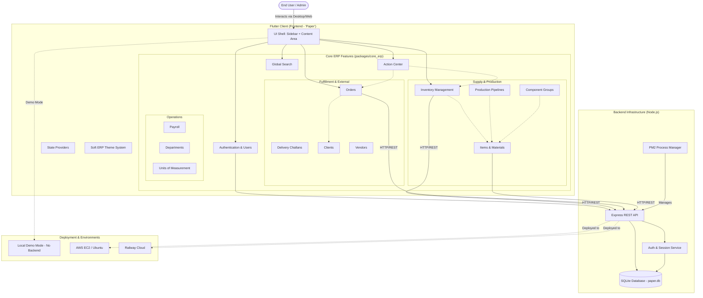

# Paper ERP - Product Architecture & Project Map

As a Product Manager, here is the high-level functional and architectural map of the Paper ERP ecosystem. It outlines the primary user interfaces, core functional modules, the backend infrastructure, and the deployment environments.

## Module Breakdown
1. **Frontend (`packages/core_erp`)**: The application leverages a modular architecture. Core domains like `Inventory`, `Orders`, `Production Pipelines`, and `Groups` are isolated into feature folders. They plug into a primary UI shell that uses a Sidebar + Main Content Area pattern.
2. **Backend**: A lean Node.js + SQLite stack managed via PM2. Handles strict role-based authentication, retention management, and serves the core REST API to the Flutter client.
3. **Environments**: The project supports a pure local "Demo Mode" with seeded data (no backend required), alongside robust production deployment strategies for AWS EC2 and Railway.
