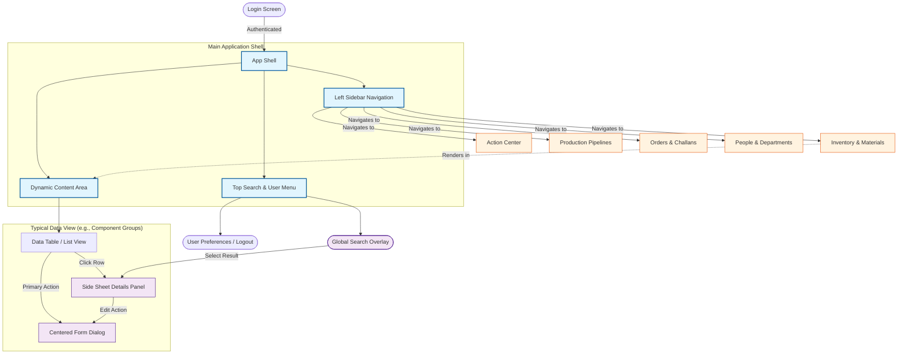

# Paper ERP - UX & Navigation Flow

As a Product Manager, this graph maps out the high-level User Experience (UX) architecture, layout structure, and typical user navigation flows within the application.

## UX Architecture Principles
1. **The 'L' Shape Layout**: The app utilizes a fixed left sidebar for primary navigation and a persistent top bar for global actions (Search, Profile). The remaining screen real estate is dedicated to the dynamic content area.
2. **Progressive Disclosure (Side Sheets)**: Instead of navigating the user away to a new page to view details, clicking a record (like a Component Group) opens a responsive **Side Sheet** anchored to the right. This keeps the user in context with the underlying list view.
3. **Focused Data Entry (Centered Dialogs)**: Creation and editing actions are typically handled via **Centered Form Dialogs** (`showErpFormDialog`) to ensure the user's focus is captured exclusively for data entry, before returning them to their previous context.
4. **Global Accessibility**: The global search is accessible from anywhere via the top bar, allowing users to jump directly to specific item side sheets without traversing the traditional sidebar hierarchy.
